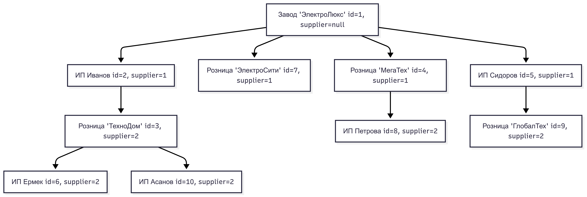

# SUPPLY NODE

## 🧾 Описание

**Supply Node** — это Django-приложение с REST API и admin-панелью, предназначенное для управления иерархической сетью
поставок электроники.
Платформа позволяет пользователям управлять объектами сети (узлами), продуктами, а администраторам — очищать
задолженность перед поставщиками через `admin-action`.

📄 Полное ТЗ — [TODO.md](readme/TODO.md)

---

## ⚙️ Основной функционал

- **JWT-аутентификация и авторизация**
- **CRUD для объектов сети (`Node`) и продуктов (`Product`)**
- **Иерархия поставок:** завод → ИП → розничная сеть или завод → розничная сеть → ИП
- **Фильтрация по стране и городу**
- **Очищение задолженности (только через админку)**

---

## 🧱 Технологии

- Python, Django, DRF
- PostgreSQL
- JWT (`djangorestframework-simplejwt`)
- `django-filter`, `drf-yasg`, `Pillow`
- Docker / Docker Compose
- Pytest / pytest-django

---

## 🚀 Запуск проекта

### 1. Клонируйте репозиторий

```bash
git clone https://github.com/stasm-skypro/supply_node.git
cd supply_node
```

### 2. Настройте переменные окружения

Создайте `.env` рядом с `compose.yaml`:

```env
SECRET_KEY=your_django_secret
DEBUG=True
ALLOWED_HOSTS=127.0.0.1,localhost

POSTGRES_DB=bulletin
POSTGRES_USER=user
POSTGRES_PASSWORD=password
POSTGRES_HOST=db
POSTGRES_PORT=5432
```

### 3. Соберите и запустите проект

```bash
docker compose up --build -d
```

Приложение будет доступно по адресу `http://127.0.0.1:8000`

### 4. Создание суперпользователя (опционально)

```bash
docker compose exec web python manage.py createsuperuser
```

По умолчанию все необходимое для функционирования приложения: создание суперпользователя и миграции уже включены и
применяются автоматически на этапе `docker compose up`. Это реализовано внутри скрипта `entrypoint-web.sh`, который
отрабатывает при запуске контейнера `web`.

---

## 🔗 API

- Документация Swagger: [`/doc/`](http://127.0.0.1:8000/doc/)
- Redoc: [`/redoc/`](http://127.0.0.1:8000/redoc/)
- JSON Schema: [`/docjson/`](http://127.0.0.1:8000/docjson/)

---

## 📦 Модели

### `Node`

Объекты сети: заводы, ИП, магазины.
Имеют поля: `name`, `email`, `supplier`, `debt_to_supplier`, `country`, `city` и др.
Поле `supplier` (поставщик) - self-relation ссылка на узел сети предстоящий по иерархии.

### `Product`

Продукты, производимые или продаваемые узлами сети.
Связаны с `Node` через `owner`.

**Пример структуры сети с уровнями**



Более подробное описание моделей и API [здесь](readme/DETAILS.md).

---

## 🔐 Роли и доступ

| Роль           | Доступ к API                       |
|----------------|------------------------------------|
| Анонимный      | ❌ Нет доступа                      |
| Авторизованный | ✅ CRUD для Node и Product          |
| Администратор  | ✅ + admin-панель + обнуление долга |

---

## 🧪 Тестирование

- Тесты написаны с использованием библиотеки `pytest` и `pytest-django`.
- Тесты покрывают основные функции платформы, включая CRUD операции для моделей, аутентификацию, права доступа и логику
  API эндпоинтов.

Покрытие: регистрация, вход, права доступа, CRUD и бизнес-логика.

---

## 🧠 Логика и архитектура

Сеть строится в виде дерева, где каждый узел (`Node`) может иметь одного поставщика (`supplier`) и множество
клиентов.
Уровень иерархии определяется глубиной цепочки: завод (0), ИП (1+), розничная сеть (2+).

**Преимущества:**

- Гибкость при построении и анализе цепочек
- Основа для логистики, скидок и расчётов
- Поддержка вложенных продуктов и фильтрации

---

## 💡 Потенциал расширения

- Денежный поток: связать товар/деньги в узле
- Расчёты долгов, отчёты, графики
- Интеграция с платёжными системами

---

## Naming

Проект имеет название **SupplyNode**
→ подчёркивает узловую структуру и цепочку поставок (универсально, современно, подходит как внутренняя система, так и
внешняя B2B-платформа).

Если рассматривать проект, как стартап и возможность развития, то можно использовать следующие варианты "более
маркетинговых" названий:

**NexNode**
→ от "Next Node" — указывает на узлы сети, переход между звеньями.

**NetVendor**
→ Звенья + поставки (vendor), звучит надёжно.

**SupplyNest**
→ "Гнездо поставок" — платформа, объединяющая всех участников. "Гнездо" не очень благозвучно для "русского" уха, но для
англоговорящего потребителя вполне маркетинговое название.

---

## 🧹 Pre-commit хуки

В проекте используется pre-commit для автоматической проверки и форматирования кода перед каждым коммитом.

### 🔧 Установка и использование

Установите pre-commit (один раз глобально):

``pip install pre-commit``

Установите хуки в репозиторий:

``pre-commit install``

Чтобы вручную запустить все проверки:

``pre-commit run --all-files``

### 🔍 Подключенные хуки

- pre-commit-hooks
- check-added-large-files: проверка на слишком большие файлы
- check-merge-conflict: проверка на незавершённые merge-конфликты
- end-of-file-fixer: добавляет пустую строку в конец файла
- trailing-whitespace: удаляет пробелы в конце строк
- debug-statements: блокирует print() и pdb
- name-tests-test: проверяет, что тестовые функции начинаются с test_

- **Black** — автоформатирование Python-кода
- **isort** — сортировка импортов
- **Flake8** — линтинг с поддержкой:
- **flake8**-bugbear
- **flake8**-comprehensions
- **Mypy** — статическая проверка типов
- Исключение для migrations/
- Подключены типы для requests и django-stubs
- **pyupgrade** — автообновление синтаксиса до Python 3.11+

Конфигурация находится в файле .pre-commit-config.yaml.
